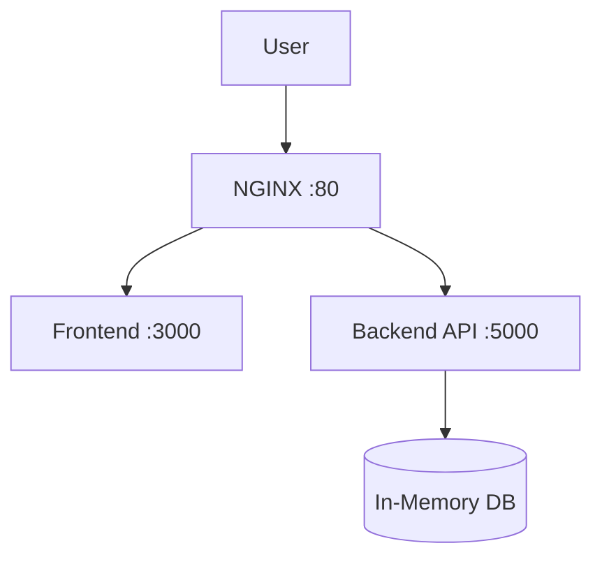

# Employee Management

[](https://github.com/example/employee-management/actions/workflows/deploy.yml)

A full-stack employee management application with a React frontend, Python REST API, and Docker-based deployment to AWS.

---

## Tech Stack

| Category       | Technology                      |
| -------------- | ------------------------------- |
| **Frontend**   | React, TypeScript, Vite          |
| **Backend**    | Python 3.11, Flask, Gunicorn     |
| **Proxy**      | NGINX                           |
| **Container**  | Docker & Docker Compose          |
| **CI/CD**      | GitHub Actions                   |
| **Cloud**      | AWS (ECR, ECS Fargate, EC2)      |

---

## Project Structure

```
employee-management/
├── .github/workflows/deploy.yml   # CI/CD pipeline
├── backend/
│   ├── Dockerfile
│   ├── app.py                     # Flask API
│   ├── requirements.txt
│   └── .env.example
├── frontend/
│   ├── Dockerfile
│   ├── package.json
│   ├── src/
│   └── .env.example
├── nginx/
│   └── default.conf
├── scripts/
│   ├── setup.sh                   # Local dev setup
│   ├── deploy_ec2.sh              # EC2 deployment
│   ├── deploy_ecs.sh              # ECS deployment
│   └── stop_services.sh           # Tear down
├── docs/
│   ├── architecture.md
│   └── troubleshooting.md
├── docker-compose.yml
├── .env.example
└── README.md
```

---

## Quick Start (Docker)

**Prerequisites:** Docker, Docker Compose

```bash
# 1. Clone the repo
git clone https://github.com/example/employee-management.git
cd employee-management

# 2. Run setup
chmod +x scripts/setup.sh && ./scripts/setup.sh

# 3. Open in browser
open http://localhost
```

To stop all services:

```bash
./scripts/stop_services.sh
```

---

## Environment Variables

| Variable            | Default        | Description                         |
| ------------------- | -------------- | ----------------------------------- |
| `FLASK_ENV`         | `development`  | Flask environment mode              |
| `FLASK_DEBUG`       | `1`            | Enable Flask debug mode             |
| `BACKEND_PORT`      | `5000`         | Backend container port              |
| `FRONTEND_PORT`     | `3000`         | Frontend dev server port            |
| `NGINX_PORT`        | `80`           | Public-facing NGINX port            |

Copy `.env.example` to `.env` to override defaults.

---

## API Endpoints

| Method | Endpoint               | Description             |
| ------ | ---------------------- | ----------------------- |
| GET    | `/api/health`          | Health check            |
| GET    | `/api/employees`       | List all employees      |
| GET    | `/api/employees/:id`   | Get employee by ID      |
| POST   | `/api/employees`       | Create an employee      |
| PUT    | `/api/employees/:id`   | Update an employee      |
| DELETE | `/api/employees/:id`   | Delete an employee      |

---

## Deployment Options

### EC2 (single-instance)

```bash
sudo ./scripts/deploy_ec2.sh
```

The script installs Docker, clones the repo, and runs `docker compose up --build -d`.

### ECS (Fargate — production)

Push to the `main` branch triggers the GitHub Actions pipeline:

1. **Test** — Python backend and Node frontend checks
2. **Build & Push** — Docker images to Amazon ECR
3. **Deploy** — Force-update the ECS service

For manual deployment:

```bash
./scripts/deploy_ecs.sh
```

---

## Architecture



NGINX routes requests on port 80:
- `/api/*` → backend (port 5000)
- everything else → frontend (port 3000)

See [docs/architecture.md](docs/architecture.md) for details.

---

## Troubleshooting

Refer to [docs/troubleshooting.md](docs/troubleshooting.md) for solutions to common issues.
