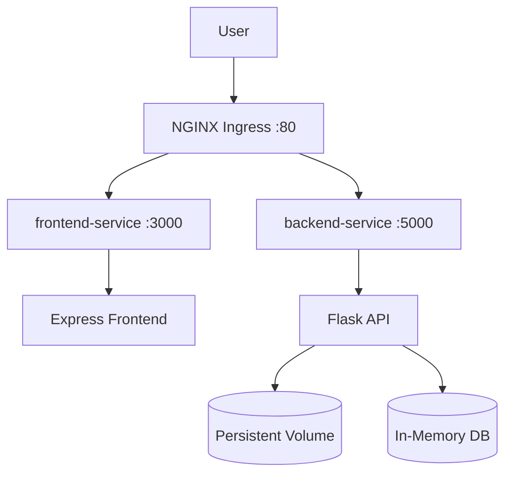

# Employee Management

A full-stack employee management application with an **Express (EJS) frontend**, a **Flask REST API** backend, and deployments via **Docker Compose**, **Kubernetes (Minikube)**, and **Terraform (AWS)**.

---

## Tech Stack

| Category       | Technology                      |
| -------------- | ------------------------------- |
| **Frontend**   | Express, EJS, Bootstrap         |
| **Backend**    | Python, Flask, Gunicorn         |
| **Container**  | Docker                          |
| **Orchestration** | Kubernetes (Minikube + kustomize) |
| **CI/CD**      | GitHub Actions                  |
| **Cloud**      | AWS (Terraform)                 |

---

## Project Structure

```
employee-management/
├── .github/workflows/deploy.yml   # CI pipeline (test + build)
├── backend/
│   ├── Dockerfile                 # Flask API image
│   ├── app.py                     # Flask app factory
│   ├── routes.py                  # API route handlers
│   ├── models.py                  # In-memory data layer
│   ├── config.py                  # Config from env vars
│   └── requirements.txt
├── frontend/
│   ├── Dockerfile                 # Express image
│   ├── server.js                  # Express server
│   ├── routes/index.js            # Page routes
│   └── views/                     # EJS templates
├── k8s/                           # Kubernetes manifests (kustomize)
│   ├── kustomization.yaml
│   ├── namespace.yaml
│   ├── configmap.yaml             # non-secret config
│   ├── secret.yaml                # secret values (base64)
│   ├── pvc.yaml                   # backend storage claim
│   ├── backend-deployment.yaml
│   ├── backend-service.yaml
│   ├── frontend-deployment.yaml
│   ├── frontend-service.yaml
│   └── ingress.yaml
├── docker/nginx/nginx.conf        # reverse proxy (docker-compose)
├── docker-compose.yml
├── scripts/
│   ├── setup.sh                   # Docker Compose setup
│   ├── deploy_minikube.sh         # build + deploy to Minikube
│   ├── deploy_ec2.sh              # EC2 deploy reference
│   ├── deploy_ecs.sh              # ECS deploy reference
│   └── stop_services.sh           # docker compose down
├── terraform/                     # AWS deployments (3 parts)
└── README.md
```

---

## Quick Start (Docker Compose)

**Prerequisites:** Docker, Docker Compose

```bash
# 1. Clone the repo
git clone git@github.com:AbhishekDesaii/employee-management-aws.git
cd employee-management-aws

# 2. Run setup
chmod +x scripts/setup.sh && ./scripts/setup.sh

# 3. Open in browser
open http://localhost
```

To stop all services:

```bash
./scripts/stop_services.sh
```

---

## Kubernetes (Minikube) Deployment

This is the primary deliverable of the assignment: the app is deployed to a local
Kubernetes cluster (Minikube) using manifests managed by **kustomize**.

### 1. Install & start Minikube

```bash
# Install Minikube (Linux example)
curl -LO https://storage.googleapis.com/minikube/releases/latest/minikube-linux-amd64
sudo install minikube-linux-amd64 /usr/local/bin/minikube

# Start the cluster (uses the Docker driver)
minikube start --driver=docker

# Enable the nginx ingress controller
minikube addons enable ingress
```

### 2. Deploy the application

Everything is automated in one script:

```bash
./scripts/deploy_minikube.sh
```

The script does the following:

1. Confirms Minikube is running (and enables the `ingress` addon if needed).
2. Builds the `employee-backend:latest` and `employee-frontend:latest` images
   directly inside the Minikube Docker daemon.
3. Applies all Kubernetes manifests with `kubectl apply -k k8s/` (kustomize).
4. Waits for the pods to become ready.
5. Verifies the backend health endpoint and the frontend page through the ingress.

### 3. Browse the app

```bash
minikube ip                        # prints the cluster IP, e.g. 192.168.49.2
echo "<minikube-ip> employee.local" | sudo tee -a /etc/hosts
open http://employee.local
```

### 4. Verify the deployment

```bash
# Cluster status
minikube status

# Workloads
kubectl -n employee-system get pods,deployments,services,pvc

# Ingress
kubectl -n employee-system get ingress

# Backend health through the ingress
curl -H "Host: employee.local" http://$(minikube ip)/api/health

# Logs
kubectl -n employee-system logs deploy/employee-backend
kubectl -n employee-system logs deploy/employee-frontend
```

### 5. Clean up

```bash
kubectl delete -k k8s/             # remove the workloads
minikube stop                      # stop the VM/container
minikube delete                    # delete the cluster entirely
```

### What the manifests demonstrate

| Manifest | Purpose |
| -------- | ------- |
| `namespace.yaml` | Isolates the app in the `employee-system` namespace |
| `configmap.yaml` | Non-secret config (ports, workers, API URL) |
| `secret.yaml` | `SECRET_KEY` stored as a Secret (base64), not hardcoded |
| `pvc.yaml` | 1 Gi PersistentVolumeClaim for backend storage |
| `backend-deployment.yaml` | Flask API (2 replicas) using the Secret, ConfigMap, and PVC |
| `frontend-deployment.yaml` | Express app using the ConfigMap (backend URL) |
| `ingress.yaml` | NGINX ingress routing `employee.local` to both services |

---

## Environment Variables

| Variable          | Where used      | Description                  |
| ----------------- | --------------- | ---------------------------- |
| `PORT`            | backend/frontend | Port the server listens on  |
| `HOST`            | backend         | Bind address for gunicorn    |
| `SECRET_KEY`      | backend         | Flask secret (from Secret)   |
| `API_BASE_URL`    | frontend        | Backend URL used by Express  |
| `GUNICORN_WORKERS`| backend         | Number of gunicorn workers   |

---

## API Endpoints

| Method | Endpoint             | Description             |
| ------ | -------------------- | ----------------------- |
| GET    | `/api/health`        | Health check            |
| GET    | `/api/employees`     | List all employees      |
| GET    | `/api/employees/:id` | Get employee by ID      |
| POST   | `/api/employees`     | Create an employee      |
| PUT    | `/api/employees/:id` | Update an employee      |
| DELETE | `/api/employees/:id` | Delete an employee      |
| GET    | `/api/departments`   | List departments        |
| GET    | `/api/projects`      | List projects           |
| GET    | `/api/stats`         | Dashboard statistics    |

---

## Deployment Options

### Docker Compose (local)

```bash
./scripts/setup.sh
```

### Kubernetes / Minikube (local)

```bash
./scripts/deploy_minikube.sh
```

### AWS (Terraform)

See [terraform/](terraform/README.md) for three configurations that deploy the
app to AWS:

| Part | Configuration                                              | Directory                |
| ---- | ---------------------------------------------------------- | ------------------------ |
| 1    | Flask + Express on a single EC2 instance                   | `terraform/part1-single-ec2/` |
| 2    | Flask + Express on two separate EC2 instances              | `terraform/part2-separate-ec2/` |
| 3    | Flask + Express as Docker containers (ECR + ECS + ALB)     | `terraform/part3-ecs/` |

```bash
cd terraform/part1-single-ec2   # or part2-separate-ec2 / part3-ecs
terraform init && terraform plan && terraform apply -auto-approve
```

---

## Architecture



NGINX routes requests on port 80:
- `/api/*` → backend (port 5000)
- everything else → frontend (port 3000)
