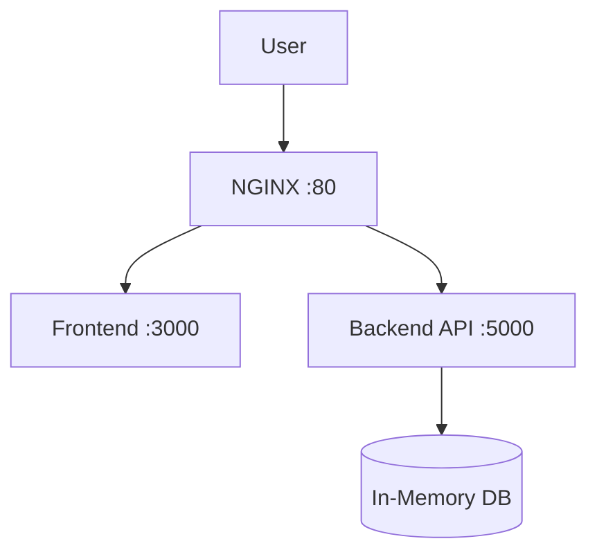

# Architecture

## Diagram



## Overview

The Employee Management system follows a **three-tier architecture** with a reverse proxy sitting in front of the frontend and backend services.

| Layer        | Technology                | Port  | Role                                      |
| ------------ | ------------------------- | ----- | ----------------------------------------- |
| **Proxy**    | NGINX                     | 80    | Reverse proxy, routing, static file cache |
| **Frontend** | React / Vite              | 3000  | Single-page application (SPA)             |
| **Backend**  | Python (Flask / FastAPI)  | 5000  | REST API, business logic                  |
| **Storage**  | In-memory (dict / list)   | —     | Volatile employee data store              |

## Tech Stack

- **Frontend:** React, TypeScript, Vite
- **Backend:** Python 3.11+, Flask (or FastAPI), Gunicorn
- **Proxy:** NGINX (static file serving + API routing)
- **Containers:** Docker & Docker Compose
- **CI/CD:** GitHub Actions → Amazon ECS (Fargate)
- **Infrastructure:** AWS (ECR, ECS, EC2)

## Data Flow

1. A user sends an HTTP request to **NGINX** on port 80.
2. NGINX inspects the request path:
   - Requests starting with `/api/` are proxied to the **Backend** (port 5000).
   - All other requests are served by the **Frontend** (port 3000).
3. The **Backend** processes API requests (CRUD for employees) against an **in-memory data store**.
4. The **Frontend** receives JSON responses and renders the UI.

## Container Layout

```
employee-management/
├── docker-compose.yml       # Orchestrates nginx, frontend, backend
├── nginx/
│   └── default.conf         # Reverse proxy configuration
├── backend/
│   ├── Dockerfile
│   ├── app.py               # API entry point
│   └── requirements.txt
└── frontend/
    ├── Dockerfile
    ├── package.json
    └── src/
```

## Notes

- The in-memory DB is volatile — data resets when the container restarts.
- For production, replace the in-memory store with PostgreSQL or DynamoDB.
